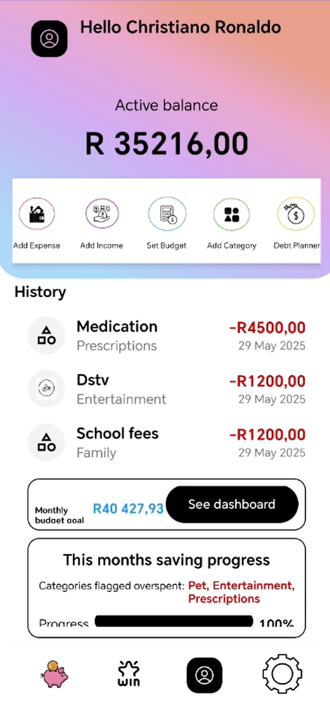

# 💸 AstraVault

## 📝 DESCRIPTION
This project is a Personal Finance Management application built with Android Studio using Kotlin. AstraVault allows users to track and budget their finances using the applications tools to ensure our users successful financial management.

## WHAT IS THE PURPOSE OF THE APP?
AstraVault was built to guide and empower users to take control of their personal finances by providing a diverse set of tools for financial tracking and planning.
The application enables users to monitor their daily income and expenses, manage budgets, and set achievable financial goals. It also supports debt repayment planning and encourages the development of strong savings habits.
With built-in motivation features such as an achievement system, the application helps users stay engaged and committed to their financial journey.
By offering clear insights and tracking tools, the app assists users in making informed financial decisions and achieving long-term financial stability.

## App Overview

  
  
  

## 💡 Design Overview
### UI/UX Design
- 🎨 Color Scheme

- Follows Material Design 3 for a modern and consistent interfaces
- Responsive layouts using ConstraintLayout & LinearLayout
- Custom backgrounds, gradients, and color schemes for visual appeal
- Reusable components: buttons, input fields, progress indicators, sliders
- Accessible design: proper contrast, touch targets (48dp+), screen size support
- Clear navigation: bottom navigation, back buttons, and smooth transitions
- Consistent spacing, padding (16dp, 24dp), and typography hierarchy
- Uses custom fonts and iconography for branding

### 💿 Backend Architecture

#### Data Management
- Direct Firebase Firestore integration for data persistence across various devices
- Coroutines for asynchronous operations
- Flow for reactive data streams
- Dispatchers.IO for background operations

#### User Management (FirebaseUserService)
- User profile operations
- Authentication management
- Profile management and updates
- Credential management

#### Expense Management (FirebaseExpenseService)
- CRUD operations for expenses
- Expense filtering by date range
- Category-based expense tracking
- Total spending calculations
- Pagination support

#### Budget Management (FirebaseBudgetService)
- Monthly budget creation and updates
- Budget category management
- Active budget tracking
- Budget goal monitoring

#### Savings Management (FirebaseSavingsService)
- Savings tracking
- Total savings calculations
- Savings updates

#### Income Management (FirebaseIncomeService)
- Income record management
- Income categorization
- Income history tracking

#### Category Management (FirebaseCategoryService)
- Category creation and updates
- Category limits
- Spending tracking per category

#### Award System (FirebaseAwardService)
- Award tracking
- Achievement monitoring
- Progress tracking

#### Database Structure
Collections in Firestore:
- users - User profiles and preferences
- expenses - Expense records
- budgets - Budget plans
- savings - Savings records
- income - Income records
- categories - Expense categories
- awards - User achievements

#### Security Features
- Firebase Authentication
- Password hashing using BCrypt
- User-specific data isolation
- Input validation in UI layer

#### Error Handling
- Try-catch blocks for operation safety
- Graceful fallbacks for failed operations
- Error logging
- User-friendly error messages

## 👩‍💻 GETTING STARTED

1. Within the repository, click on the "<> Code" drop down on the far right next to the "Go to file" and "+" buttons.
2. On the Local tab, click on the last option: "Download ZIP".
3. Once the zip file has downloaded, open your local file explorer.
4. Go to your Downloads.
5. Click on the "ST10251981_DeslynnFenyes_PROG7313_Part3_Group1.zip" folder, should be most recent in Downloads.
6. Extract the files and store the project in the location of choice.
7. Navigate to Android Studio.
8. To open the project, click File > Open > Choose the project.
9. To run the application, click on the play button.

## 👾 TECHNOLOGIES USED

Android Studio,
Kotlin

## 🎲 FEATURES

Users can:
- Add income.
- Add expenses with receipts attached.
- View their expenses during a  user selectable time period.
- Add categories the expenses belong to.
- View the total amount of money spent on each category during a user selectable time period.
- Set a max and min monthly budget.
- Use the debt planner to calculate how much to pay off per month
- View their spending trends in the dashboard
- Contribute to savings

### Additional Features
💰 Savings page
- Users can set a savings goal and add to their savings regularly to motivate the user to put aside money.

🏅 Awards page
- Users can track their savings progress. Once the user reaches their savings goal, they are awarded with a gift card.

💰 Debt Planner
- Users can enter the amount of debt, their total salary and the time period they need, the app will calculate how much the user should pay per month.
- This assists users in paying off their debt efficiently.

These features of ours are gamification elements made to encourage the user to save money and make the budgeting experience fun!

## UTILIZATION OF GITHUB AND GITHUB ACTIONS
Used Github workflows to ensure that the app runs on other devices.
Commited frequently to keep the code safe and retrievable when we needed to revert back code.

## 📺 YOUTUBE LINK: https://www.youtube.com/watch?v=IRhDbqx6ksU
